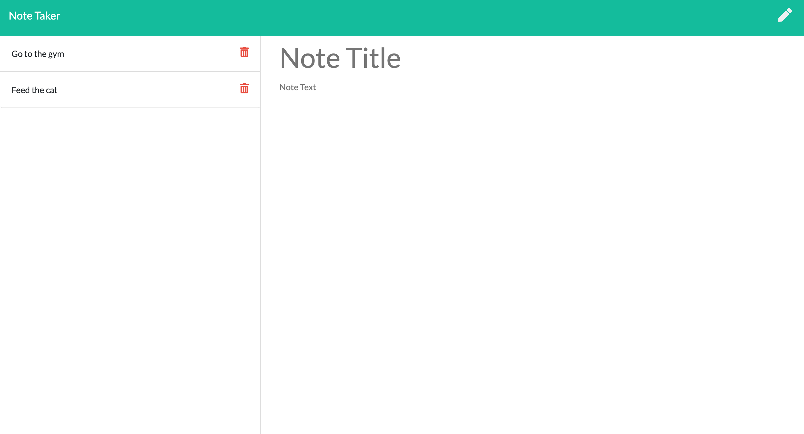

# Note Take Homework 11

The aim of this assignment is to create a application that is used to write, save and delete notes using an express backend that will save and retrieve data from a JSON file.

# Testing
No testing required

# Deploying the App

This application is deployed onto heroku as the server side code can not be deployed onto GitHub pages.
Deployed link https://note-taker-sumaya.herokuapp.com